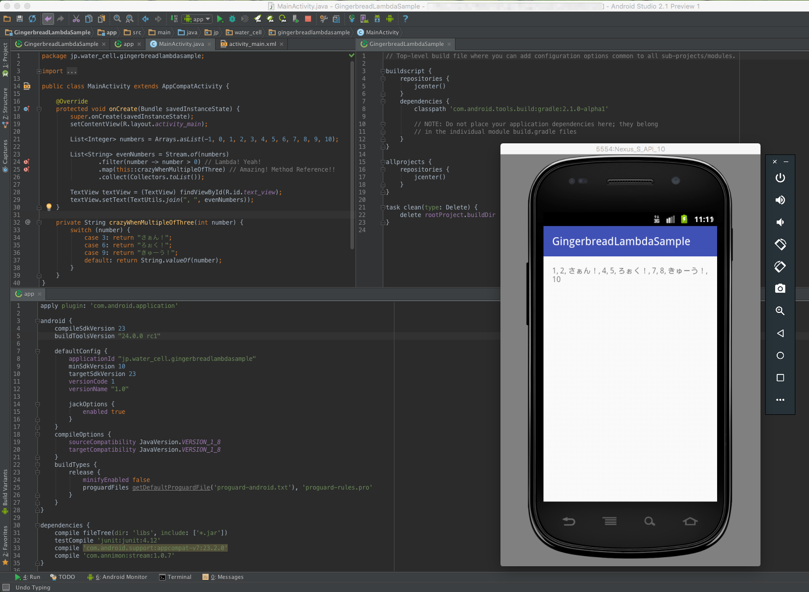

GingerbreadLambdaSample
==========

>  We’re excited to bring Java 8 language features to Android. With Android's Jack compiler, you can now use many popular Java 8 language features, including lambdas and more, on Android versions as far back as Gingerbread.  
> [First Preview of Android N: Developer APIs & Tools | Android Developers Blog](http://android-developers.blogspot.jp/2016/03/first-preview-of-android-n-developer.html)

Gingerbread gets Lambda without Retrolambda!!

This sample app run on Android 2.3.3.

Requirement
----------

My environment,

* Android Studio: 2.1 Preview 1
* Android SDK Tools: 25.0.9
* Android SDK Platform-tools 24.0.0 rc1
* Android SDK Build-tools 24.0.0 rc1

Screenshot
----------

LICENSE
----------

The MIT License (MIT)
Copyright (c) 2016 Yukiya Nakagawa

Permission is hereby granted, free of charge, to any person obtaining a copy of this software and associated documentation files (the "Software"), to deal in the Software without restriction, including without limitation the rights to use, copy, modify, merge, publish, distribute, sublicense, and/or sell copies of the Software, and to permit persons to whom the Software is furnished to do so, subject to the following conditions:

The above copyright notice and this permission notice shall be included in all copies or substantial portions of the Software.

THE SOFTWARE IS PROVIDED "AS IS", WITHOUT WARRANTY OF ANY KIND, EXPRESS OR IMPLIED, INCLUDING BUT NOT LIMITED TO THE WARRANTIES OF MERCHANTABILITY, FITNESS FOR A PARTICULAR PURPOSE AND NONINFRINGEMENT. IN NO EVENT SHALL THE AUTHORS OR COPYRIGHT HOLDERS BE LIABLE FOR ANY CLAIM, DAMAGES OR OTHER LIABILITY, WHETHER IN AN ACTION OF CONTRACT, TORT OR OTHERWISE, ARISING FROM, OUT OF OR IN CONNECTION WITH THE SOFTWARE OR THE USE OR OTHER DEALINGS IN THE SOFTWARE.